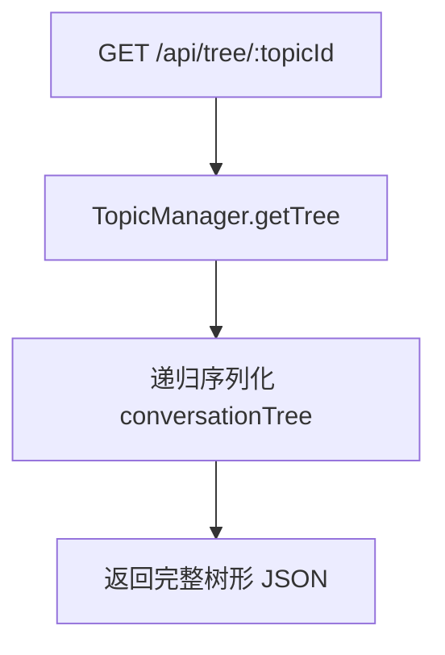
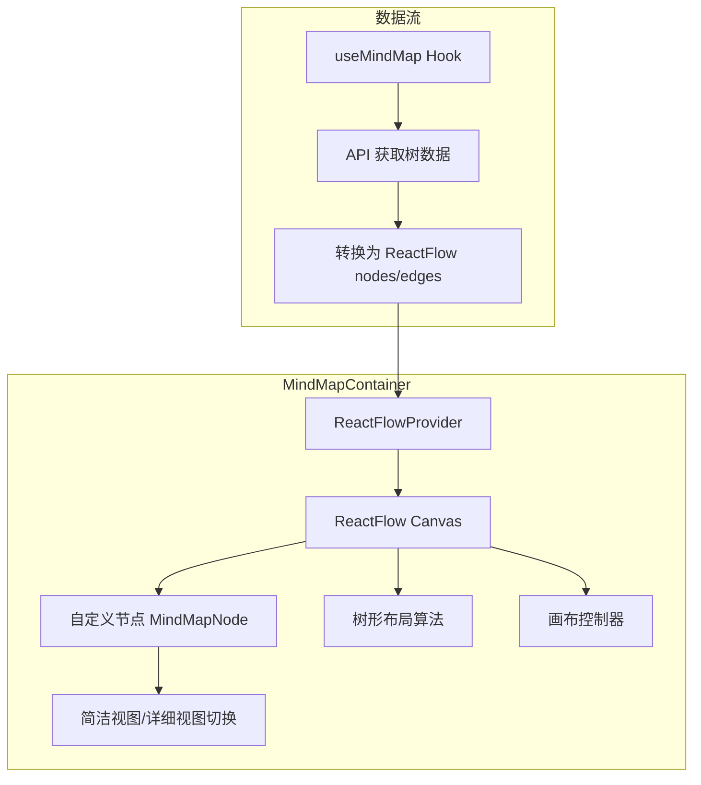

## 产品概述

将 TreeFlow 的线性对话列表升级为放射状思维导图（脑图）形式，更直观地展示对话的树形分支结构。每个节点包含问题和回答，支持简洁/详细内容切换，画布可拖拽缩放。

## 核心功能

- **放射状脑图布局**：从中心向外辐射展示对话树，未选中时默认垂直流向下一节点
- **节点内容切换**：简洁模式显示回答摘要（如"9"），展开模式显示完整内容（如计算过程）
- **画布交互**：支持拖拽移动视图、滚轮缩放
- **多分支展示**：一个父节点可以展开显示多个子分支路径
- **节点操作**：点击节点展开/折叠详情，从任意节点创建新分支

## 技术栈选择

- **前端库**：react-flow（已验证支持 React 18，提供节点自定义、画布交互、多种布局算法）
- **布局算法**：@reactflow/layout 或自定义 D3.js 树形布局计算
- **状态管理**：复用现有 useChat hook，新增树形数据结构转换

## 技术架构

### 后端扩展

新增 API 端点返回完整对话树结构（当前仅返回当前路径的线性消息）。



### 前端架构



### 核心数据结构

**后端响应格式**：

```typescript
interface TreeNode {
  id: string;
  parentId: string | null;
  question: string;      // 用户消息
  answer: string;        // AI 回答
  answerSummary: string; // 回答摘要（AI生成或截断）
  children: string[];    // 子节点ID数组
  position?: { x: number; y: number };
}
```

**ReactFlow 格式**：

```typescript
interface FlowNode {
  id: string;
  type: 'mindMapNode';
  position: { x: number; y: number };
  data: {
    question: string;
    answer: string;
    summary: string;
    isExpanded: boolean;
    childrenCount: number;
  };
}
```

### 放射状布局算法

- 使用 D3.js 的 tree() 或 cluster() 布局计算节点坐标
- 根节点位于画布中心，子节点按层级向外辐射
- 支持切换为垂直树形布局（默认自动排列）

### 实现细节

**关键目录结构**：

```
client/src/components/mindmap/
├── MindMap.jsx              # [NEW] 脑图主容器，集成 ReactFlow
├── MindMapNode.jsx          # [NEW] 自定义节点组件（简洁/详细视图）
├── MindMapControls.jsx      # [NEW] 缩放/重置控制按钮
├── useMindMapLayout.js      # [NEW] 树形布局计算 hook
└── layoutUtils.js           # [NEW] D3 布局算法封装

client/src/hooks/
└── useMindMap.js            # [NEW] 管理脑图数据状态

server/server/routes/
└── tree.routes.js           # [NEW] 树形数据 API 路由

server/server/controllers/
└── tree.controller.js       # [NEW] 树形数据控制器
```

**API 设计**：

- `GET /api/tree/:topicId` - 获取话题的完整对话树
- `POST /api/tree/expand/:nodeId` - 展开节点时懒加载子分支详情

**性能优化**：

- 虚拟渲染：仅渲染视口内的节点（ReactFlow 内置支持）
- 懒加载：子分支数据按需获取
- 节点缓存：布局计算结果缓存，避免重复计算

## 设计架构

### 应用类型

Web 桌面应用，专为复杂思维导图交互设计。

### 设计美学

采用**玻璃拟态 + 深色科技风**的混合设计，突出节点层级和连接线：

- 节点使用毛玻璃背景（backdrop-filter blur）
- 连接线使用渐变色（从中心向外颜色变浅）
- 简洁模式使用紧凑圆角卡片，详细模式展开为完整内容面板

### 页面区块设计

#### 1. 脑图画布区（主区域）

- **布局**：全屏可拖拽画布，根节点默认居中
- **节点样式**：
- 简洁模式：圆角矩形，上半部分显示问题（小号字），下半部分显示摘要（大号强调字），带发光边框
- 详细模式：展开为更大面板，显示完整问题和回答，回答区域带代码块/列表等富文本渲染
- **连接线**：贝塞尔曲线，根据分支深度使用不同透明度（越深越淡）
- **分支标记**：多分支节点显示分支数量徽标

#### 2. 悬浮工具栏（左下角）

- 缩放控制：+ / - / 重置按钮
- 布局切换：放射状 / 垂直树形
- 适应画布：自动缩放以显示全部节点

#### 3. 节点详情弹层（点击展开）

- 从节点位置展开浮层
- 显示完整对话内容
- 底部操作栏：创建分支、复制内容、关闭

### 响应式与交互

- 鼠标滚轮缩放画布（0.1x - 2x）
- 拖拽空白处移动视图
- 点击节点展开/折叠
- 双击节点进入分支模式
- 右键节点显示上下文菜单

### 视觉风格关键词

玻璃拟态、深色科技、渐变发光、圆角几何、微交互动效