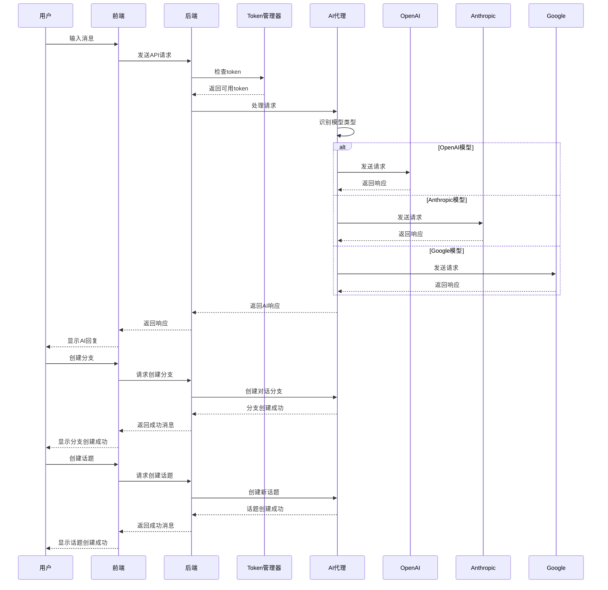

# TreeFlow - AI代理系统

## 项目概述

TreeFlow是一个基于AI的代理系统，类似于OpenClaw，支持使用token进行身份验证，提供分支对话功能，并集成了话题管理系统。项目采用现代前端技术栈，包括React、Material-UI和react-flow，为用户提供流畅的交互体验。

## 核心功能

1. **AI对话**：与AI模型进行对话，支持多种模型选择和多个AI提供商
2. **分支对话**：创建对话分支，在不影响主对话的情况下进行并行讨论
3. **话题管理**：创建和切换不同的话题，每个话题有独立的对话历史
4. **AI服务管理**：添加、删除和管理API token，支持自动模型识别和本地Ollama配置
5. **模型选择**：根据token自动识别可用模型，并允许用户手动选择
6. **多AI提供商支持**：集成OpenAI、Anthropic、Google等多个AI提供商的API
7. **脑图分支**：集成react-flow库，支持创建和管理思维导图形式的对话分支

## 技术栈

### 前端
- **React 18**：构建用户界面的核心库
- **Material-UI**：提供现代化的UI组件
- **react-flow**：用于创建交互式思维导图和分支结构
- **Vite**：快速的前端构建工具

### 后端
- **Node.js**：运行环境
- **Express**：Web服务器框架
- **CORS**：处理跨域请求
- **AI API 集成**：支持OpenAI、Anthropic、Google等多个AI提供商的API

## 项目结构

```
TreeFlow/
├── client/              # 前端代码
│   ├── src/
│   │   ├── components/  # 组件目录
│   │   │   ├── layout/  # 布局组件
│   │   │   ├── chat/    # 对话组件
│   │   │   ├── settings/# 设置组件
│   │   │   └── common/  # 通用组件
│   │   ├── hooks/       # 自定义Hooks
│   │   ├── services/    # API服务
│   │   │   └── api/     # 按模块拆分的API
│   │   ├── App.jsx      # 主应用组件
│   │   ├── index.css    # 全局样式
│   │   └── main.jsx     # 应用入口
│   ├── index.html
│   ├── package.json     # 前端依赖
│   └── vite.config.js   # Vite配置
│
├── server/              # 后端代码
│   ├── server/          # 服务器层
│   │   ├── routes/      # 路由定义
│   │   └── middleware/  # 中间件
│   ├── core/            # 核心业务逻辑
│   │   ├── agent/       # AI代理
│   │   ├── managers/    # 业务管理器
│   │   └── utils/       # 工具函数
│   ├── data/            # 数据文件
│   ├── server.js        # 服务器入口
│   ├── index.js         # 命令行界面
│   └── package.json     # 后端依赖
│
├── package.json         # 根目录脚本
└── README.md            # 项目文档
```

## 安装与运行

### 方式一：分别启动前后端

#### 前端

1. 进入frontend目录：
   ```bash
   cd frontend
   ```

2. 安装依赖：
   ```bash
   npm install
   ```

3. 启动开发服务器：
   ```bash
   npm run dev
   ```
   前端服务将在 http://localhost:3000 启动

#### 后端

1. 进入backend目录：
   ```bash
   cd backend
   ```

2. 安装依赖：
   ```bash
   npm install
   ```

3. 启动服务器：
   ```bash
   npm start
   ```
   后端服务将在 http://localhost:3003 启动

### 方式二：从根目录启动

1. 安装所有依赖：
   ```bash
   npm run install-server
   npm run install-client
   ```

2. 启动后端：
   ```bash
   npm start
   ```

3. 在另一个终端启动前端：
   ```bash
   npm run client
   ```

### 命令行界面

除了Web界面，TreeFlow还提供了命令行界面（CLI）：

```bash
cd backend
node index.js
```

命令行界面支持以下命令：
- `exit`：退出
- `branch`：创建分支
- `switch [分支ID]`：切换分支
- `switch topic [话题ID]`：切换话题
- `tokens`：查看token状态
- `addtoken [token]`：添加token
- `create topic [话题名称]`：创建话题
- `list topics`：列出话题
- `delete topic [话题ID]`：删除话题
- `current topic`：查看当前话题
- 直接输入问题：与AI对话

## 功能流程图



## 界面设计

### 布局结构
- **顶部导航栏**：包含应用名称和主要操作按钮（AI服务管理、创建分支）
- **左侧边栏**：显示话题列表，支持创建新话题
- **主内容区**：显示当前话题的对话历史和输入区域
- **模型选择**：允许用户选择不同的AI模型和提供商
- **AI服务管理**：模态框形式的AI服务管理界面，支持添加多个AI提供商的token和配置本地Ollama

### 交互流程
1. 用户打开应用，默认进入默认话题
2. 用户可以创建新话题或切换现有话题
3. 用户输入消息，选择模型和提供商（可选），发送给AI
4. 系统根据模型类型自动路由到对应的AI提供商API
5. AI返回响应，显示在对话历史中
6. 用户可以选择语句点击“添加到对话“进行提出疑问或请求，根据语句生成分支或纠正语句的错误内容
7. 用户可以管理token，添加或删除不同AI提供商的API token

## 未来规划

1. **脑图可视化**：使用react-flow实现更直观的分支对话可视化
2. **技能系统**：支持通过"/"命令调用不同的技能
3. **历史记录**：保存和管理对话历史
4. **更多AI提供商支持**：添加对更多AI提供商的支持，如Meta、Mistral等
5. **模型调优**：提供模型参数调优界面，允许用户自定义模型参数
6. **本地模型支持**：集成Ollama等本地模型运行时，支持离线使用

## 技术亮点

1. **模块化设计**：清晰的代码结构，易于维护和扩展
2. **现代UI**：使用Material-UI提供美观、响应式的用户界面
3. **智能token管理**：自动识别token对应的模型，优化API调用
4. **多AI提供商集成**：支持OpenAI、Anthropic、Google等多个AI提供商的API，提供统一的调用接口
5. **智能模型路由**：根据模型类型自动路由到对应的AI提供商API，简化用户操作
6. **流畅的交互**：实时对话和动画效果，提升用户体验
7. **可扩展性**：预留了技能系统和脑图可视化的扩展接口

## 注意事项

- 本项目需要有效的API token才能与AI模型进行交互
- 不同的AI提供商和模型可能有不同的使用限制和计费方式
- 建议使用环境变量存储敏感信息，避免硬编码token
- 某些AI模型可能需要特定的token类型，确保为每个提供商添加正确的token
- 不同AI提供商的API响应格式可能有所不同，系统会自动处理这些差异

## 贡献

欢迎提交Issue和Pull Request，共同改进TreeFlow项目。

## 许可证

本项目采用MIT许可证。