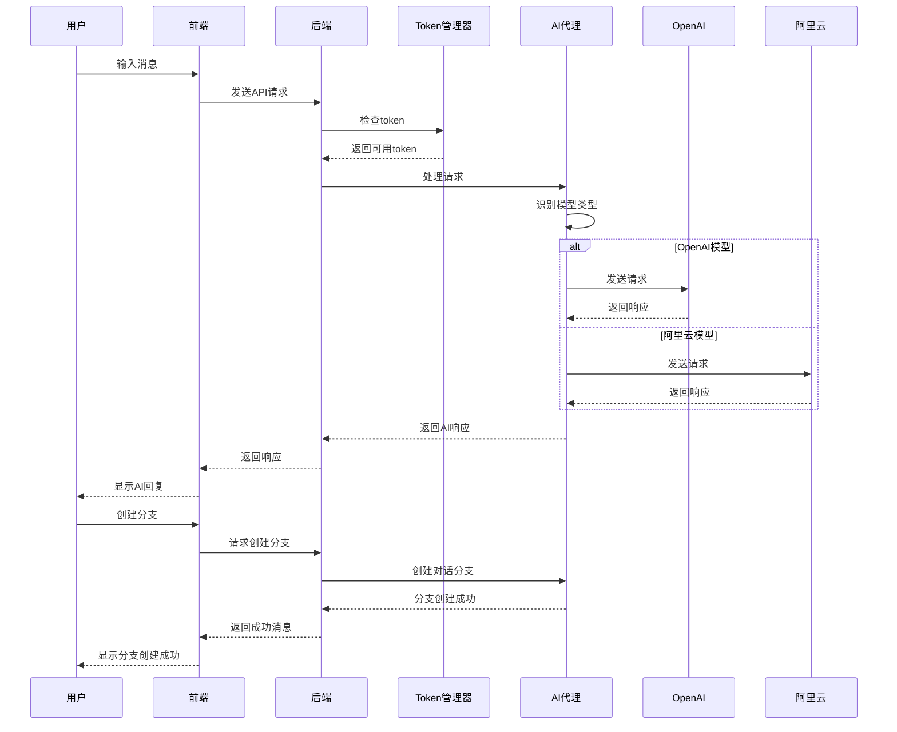

# TreeFlow - AI对话代理系统

## 项目概述

TreeFlow是一个基于AI的代理系统，核心特色是**分支对话**和**用户自主接入模型**能力。项目采用现代前端技术栈，包括React、Material-UI和AntV X6，为用户提供流畅的交互体验。

## 核心功能

1. **AI对话**：与AI模型进行对话，支持多种模型选择和多个AI提供商
2. **分支对话**：创建对话分支，在不影响主对话的情况下进行并行讨论
3. **话题管理**：创建和切换不同的话题，每个话题有独立的对话历史
4. **AI服务管理**：添加、删除和管理API token，支持自动模型识别和本地Ollama配置
5. **模型选择**：根据token自动识别可用模型，并允许用户手动选择
6. **多AI提供商支持**：集成OpenAI、Anthropic、Google、阿里云等多个AI提供商的API
7. **脑图可视化**：基于AntV X6实现对话树的交互式可视化，支持节点编辑、复制、删除

## 技术栈

### 前端
- **React 18**：构建用户界面的核心库
- **Material-UI**：提供现代化的UI组件
- **AntV X6**：用于创建交互式思维导图和分支结构
- **Vite**：快速的前端构建工具

### 后端
- **Node.js**：运行环境
- **Express**：Web服务器框架
- **CORS**：处理跨域请求
- **AI API 集成**：支持OpenAI、Anthropic、Google、阿里云等多个AI提供商的API

## 项目结构

```
TreeFlow/
├── client/              # 前端代码
│   ├── src/
│   │   ├── components/  # 组件目录
│   │   │   ├── layout/  # 布局组件
│   │   │   ├── chat/    # 对话组件
│   │   │   ├── mindmap/ # 脑图组件
│   │   │   ├── settings/# 设置组件
│   │   │   └── common/  # 通用组件
│   │   ├── hooks/       # 自定义Hooks
│   │   ├── services/    # API服务
│   │   └── App.jsx      # 主应用组件
│   ├── index.html
│   ├── package.json     # 前端依赖
│   └── vite.config.js   # Vite配置
│
├── server/              # 后端代码
│   ├── core/            # 核心业务逻辑
│   │   ├── agent/       # AI代理
│   │   ├── managers/    # 业务管理器
│   │   └── utils/       # 工具函数
│   ├── server/          # 服务器层
│   │   ├── routes/      # 路由定义
│   │   └── controllers/ # 控制器
│   ├── data/            # 数据文件
│   ├── server.js        # 服务器入口
│   └── package.json     # 后端依赖
│
├── package.json         # 根目录脚本
└── README.md            # 项目文档
```

## 安装与运行

### 安装依赖

```bash
# 安装后端依赖
npm run install-server

# 安装前端依赖
npm run install-client
```

### 启动开发服务器

```bash
# 一键启动前后端（推荐）
npm run dev

# 或者分别启动：
# 启动后端（端口 3003）
npm start

# 在另一个终端启动前端（端口 5173）
npm run dev:client
```

### 命令行界面（CLI）

```bash
cd server
node index.js
```

支持的命令：
- `exit`：退出
- `branch`：创建分支
- `switch [分支ID]`：切换分支
- `switch topic [话题ID]`：切换话题
- `create topic [话题名称]`：创建话题
- `list topics`：列出话题
- `delete topic [话题ID]`：删除话题
- 直接输入问题：与AI对话

## 功能流程图



## 界面设计

### 布局结构
- **顶部导航栏**：包含应用名称和主要操作按钮
- **左侧边栏**：显示话题列表，支持创建新话题
- **主内容区**：显示当前话题的对话树（脑图可视化）
- **底部输入区**：消息输入和模型选择

### 核心交互
1. 用户打开应用，默认进入默认话题
2. 用户可以创建新话题或切换现有话题
3. 用户输入消息，选择模型，发送给AI
4. 系统根据模型类型自动路由到对应的AI提供商API
5. AI返回响应，显示在脑图中
6. 用户可以划词引用创建分支，或在脑图中直接操作节点

## 技术亮点

1. **模块化设计**：清晰的代码结构，易于维护和扩展
2. **现代UI**：使用Material-UI提供美观、响应式的用户界面
3. **智能token管理**：自动识别token对应的模型，优化API调用
4. **多AI提供商集成**：支持多个AI提供商的API，提供统一的调用接口
5. **分支对话架构**：树形结构存储对话，支持无限分支
6. **脑图可视化**：基于AntV X6的交互式对话树展示

## 注意事项

- 本项目需要有效的API token才能与AI模型进行交互
- 不同的AI提供商和模型可能有不同的使用限制和计费方式
- 建议使用环境变量存储敏感信息，避免硬编码token
- 某些AI模型可能需要特定的token类型，确保为每个提供商添加正确的token

## 许可证

本项目采用MIT许可证。
