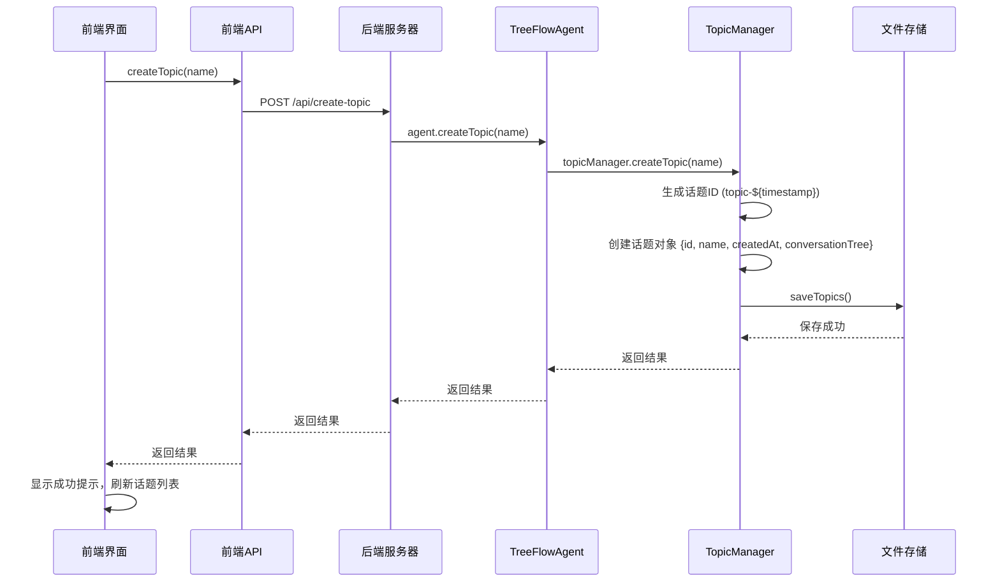
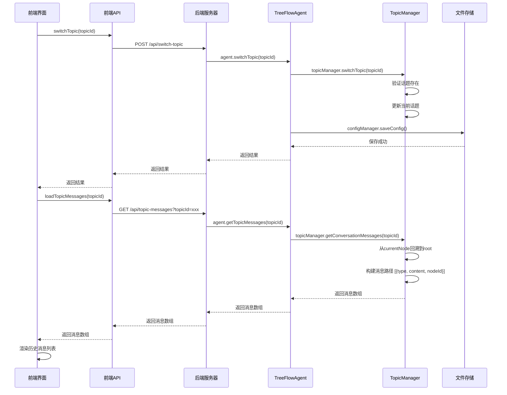
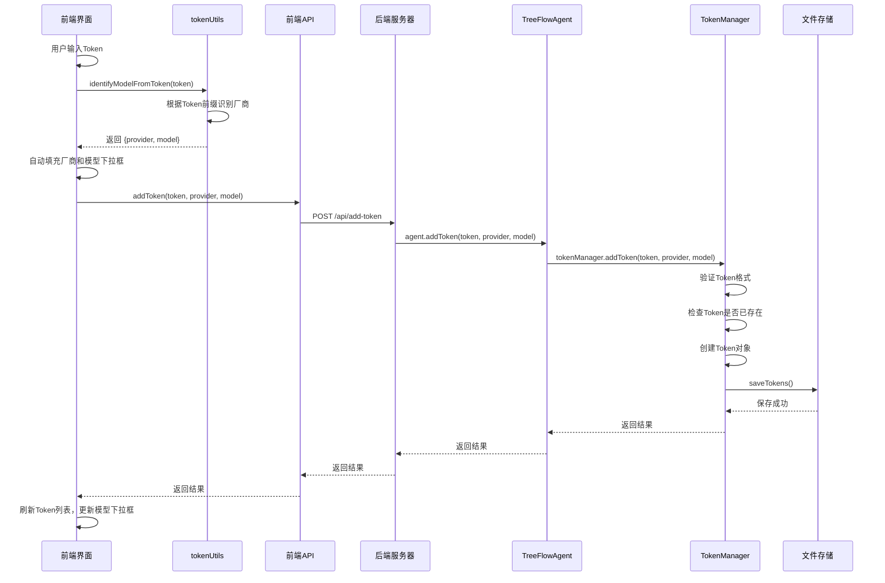
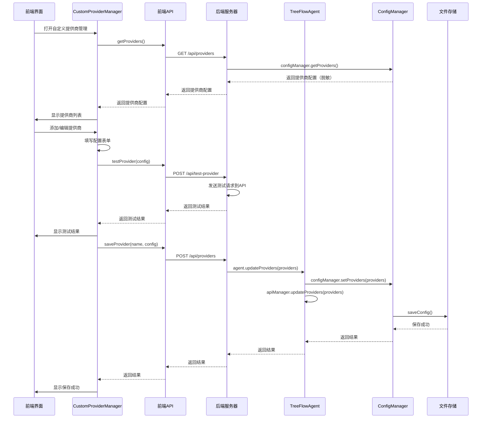
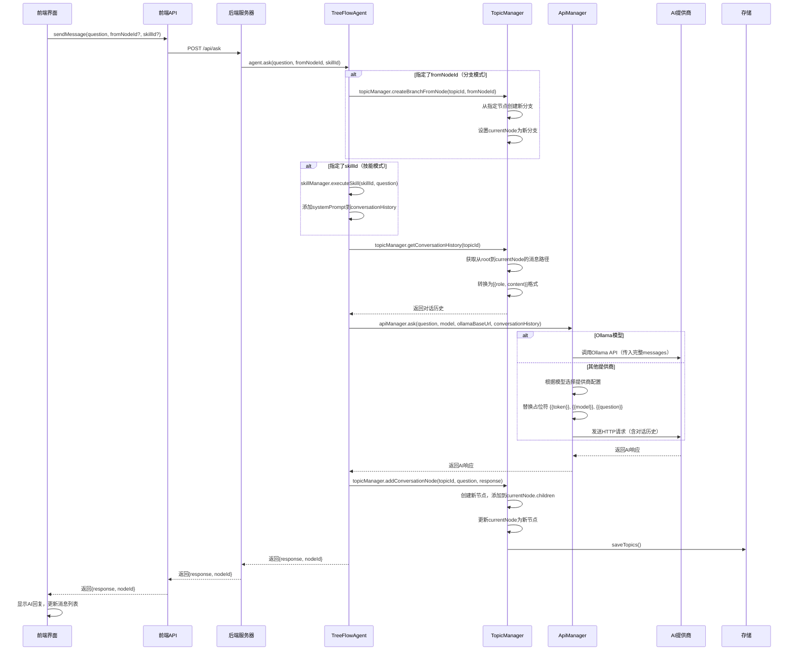
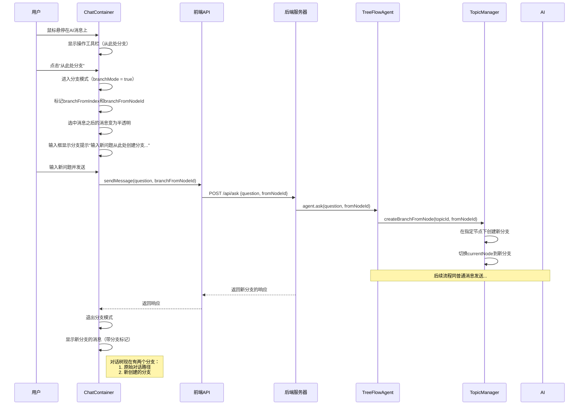
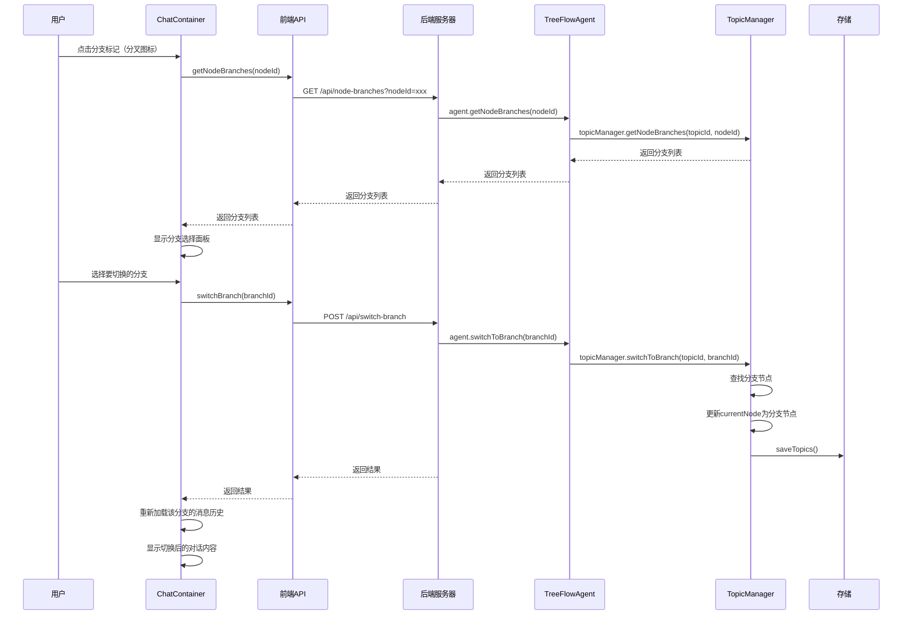
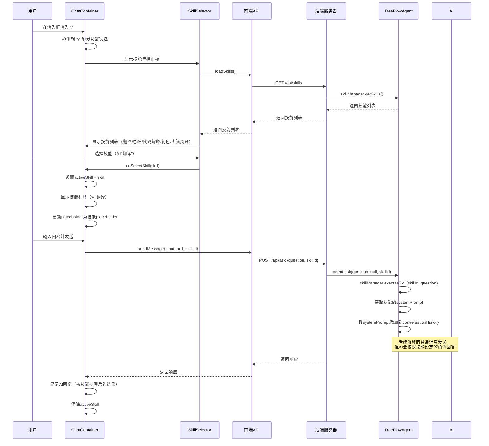

# TreeFlow 功能文档

## 产品概述

TreeFlow 是一个基于 Node.js + React 的 AI 对话代理系统，核心特色是**分支对话**和**用户自主接入模型**能力。用户可以通过简单的 Token 配置接入任意 OpenAI 兼容的 AI 服务，同时在对话过程中随时创建分支，探索不同的对话路径。

---

## 目录

1. [功能模块概览](#功能模块概览)
2. [数据结构](#数据结构)
3. [API 接口列表](#api-接口列表)
4. [核心功能详解](#核心功能详解)
5. [技术架构](#技术架构)

---

## 功能模块概览

```
TreeFlow/
├── 话题管理模块/
│   ├── 创建话题
│   ├── 列出话题
│   ├── 切换话题（自动加载历史消息）
│   └── 删除话题
├── AI服务管理模块/
│   ├── Token管理
│   │   ├── 添加Token（自动识别厂商）
│   │   ├── 删除Token
│   │   ├── 更新Token信息
│   │   ├── 列出Token
│   │   ├── 检查Token健康状态
│   │   └── 批量检查所有Token
│   ├── 自定义提供商管理
│   │   ├── 添加自定义API提供商
│   │   ├── 编辑提供商配置
│   │   ├── 删除提供商
│   │   └── 测试连接
│   └── Ollama本地模型
│       ├── Ollama启用/禁用
│       ├── Ollama URL配置
│       ├── 模型列表管理
│       ├── 拉取模型
│       └── 删除模型
├── 对话模块/
│   ├── 消息发送（支持对话历史上下文）
│   ├── 流式对话（Ollama）
│   ├── 模型切换
│   ├── Skill技能系统
│   │   ├── 翻译
│   │   ├── 总结
│   │   ├── 代码解释
│   │   ├── 润色
│   │   └── 头脑风暴
│   └── 分支对话（核心特色）
│       ├── 从指定消息创建分支
│       ├── 分支模式视觉提示
│       └── 切换分支
├── 配置管理模块/
│   ├── config.json（后端配置）
│   ├── skills.json（技能配置）
│   └── theme（主题配置：light/dark）
└── CLI命令行模块/
    ├── 对话交互
    ├── 分支管理
    ├── 话题管理
    └── Token管理
```

---

## 数据结构

### 2.1 tokens.json（Token 数据结构）

```json
{
  "tokens": [
    {
      "token": "sk-xxx...",
      "provider": "OpenAI",
      "model": "gpt-3.5-turbo",
      "createdAt": "2024-01-15T08:30:00.000Z",
      "status": "active"
    }
  ]
}
```

**字段说明：**
- `token`: Token 值（加密存储）
- `provider`: 提供商名称（OpenAI/Anthropic/Google/Ollama等）
- `model`: 默认模型名称
- `createdAt`: 创建时间
- `status`: 状态（active/inactive/expired/testing）

### 2.2 topics.json（话题数据结构）

```json
{
  "topics": {
    "topic-id-xxx": {
      "id": "topic-id-xxx",
      "name": "话题名称",
      "createdAt": "2024-01-15T08:30:00.000Z",
      "currentNodeId": "node-id-yyy",
      "conversationTree": {
        "id": "root",
        "children": [
          {
            "id": "node-1",
            "message": "用户消息",
            "response": "AI回复",
            "parentId": "root",
            "children": []
          }
        ]
      }
    }
  }
}
```

**字段说明：**
- `id`: 话题唯一标识
- `name`: 话题名称
- `currentNodeId`: 当前所在节点ID
- `conversationTree`: 对话树结构（支持多分支）

### 2.3 config.json（配置数据结构）

```json
{
  "currentModel": "gpt-3.5-turbo",
  "ollamaBaseUrl": "http://localhost:11434",
  "ollamaEnabled": false,
  "currentTopic": "default",
  "providers": {
    "OpenAI": {
      "apiUrl": "https://api.openai.com/v1/chat/completions",
      "method": "POST",
      "headers": {
        "Content-Type": "application/json",
        "Authorization": "Bearer {{token}}"
      },
      "requestBody": {
        "model": "{{model}}",
        "messages": [{"role": "user", "content": "{{question}}"}]
      },
      "responsePath": "choices[0].message.content"
    },
    "default": "OpenAI"
  }
}
```

**字段说明：**
- `currentModel`: 当前使用的模型
- `ollamaBaseUrl`: Ollama服务地址
- `ollamaEnabled`: 是否启用Ollama
- `providers`: 提供商配置模板（支持占位符 `{{token}}`, `{{model}}`, `{{question}}`）

### 2.4 skills.json（技能数据结构）

```json
[
  {
    "id": "translate",
    "name": "翻译",
    "description": "中英互译，自动识别输入语言",
    "icon": "🌐",
    "systemPrompt": "你是一个专业翻译助手...",
    "placeholder": "[翻译] 输入需要翻译的内容"
  }
]
```

---

## API 接口列表

### 3.1 /api/topics（话题管理 API）

| 方法 | 路径 | 描述 | 请求体 | 响应 |
|------|------|------|--------|------|
| GET | `/api/topics` | 获取话题列表 | - | `{topics: [{id, name}]}` |
| POST | `/api/topics` | 创建话题 | `{name}` | `{result}` |
| POST | `/api/topics/switch` | 切换话题 | `{topicId}` | `{result}` |
| DELETE | `/api/topics` | 删除话题 | `{topicId}` | `{result}` |
| GET | `/api/topics/current` | 获取当前话题 | - | `{currentTopic: {id, name}}` |

### 3.2 /api/tokens（Token 管理 API）

| 方法 | 路径 | 描述 | 请求体 | 响应 |
|------|------|------|--------|------|
| GET | `/api/tokens` | 获取Token列表 | - | `{tokens: [...]}` |
| POST | `/api/tokens` | 添加Token | `{token, provider, model}` | `{result}` |
| DELETE | `/api/tokens` | 删除Token | `{token}` | `{result}` |
| PUT | `/api/tokens/info` | 更新Token信息 | `{token, newToken, provider, model}` | `{result}` |
| PUT | `/api/tokens/status` | 更新Token状态 | `{token, status}` | `{result}` |
| DELETE | `/api/tokens/all` | 清除所有Token | - | `{result}` |
| POST | `/api/tokens/check-health` | 检查Token健康 | `{token}` | `{result: {healthy, message}}` |
| POST | `/api/tokens/check-all-health` | 批量检查Token | - | `{results: [...]}` |
| GET | `/api/tokens/stats` | 获取Token统计 | - | `{stats: [...]}` |

### 3.3 /api/models（模型管理 API）

| 方法 | 路径 | 描述 | 请求体 | 响应 |
|------|------|------|--------|------|
| GET | `/api/models` | 获取可用模型列表 | - | `{models: [{id, name, available}]}` |
| POST | `/api/models/current` | 设置当前模型 | `{model}` | `{result}` |
| GET | `/api/models/current` | 获取当前模型 | - | `{model}` |

### 3.4 /api/providers（提供商管理 API）

| 方法 | 路径 | 描述 | 请求体 | 响应 |
|------|------|------|--------|------|
| GET | `/api/providers` | 获取提供商配置 | - | `{providers: {...}}` |
| POST | `/api/providers` | 添加/更新提供商 | `{name, config}` | `{result}` |
| DELETE | `/api/providers/:name` | 删除提供商 | - | `{result}` |
| POST | `/api/providers/test` | 测试提供商连接 | `{config, token, model}` | `{success, status, body/error}` |

### 3.5 /api/ollama（Ollama 管理 API）

| 方法 | 路径 | 描述 | 请求体 | 响应 |
|------|------|------|--------|------|
| GET | `/api/ollama/config` | 获取Ollama配置 | - | `{url, enabled}` |
| POST | `/api/ollama/url` | 设置Ollama URL | `{url}` | `{result}` |
| POST | `/api/ollama/enabled` | 设置Ollama启用状态 | `{enabled}` | `{result}` |
| GET | `/api/ollama/status` | 检测Ollama连接状态 | - | `{connected, message}` |
| GET | `/api/ollama/models` | 获取Ollama模型列表 | - | `{models: [...]}` |
| POST | `/api/ollama/pull` | 拉取Ollama模型 | `{model}` | `{result}` |
| DELETE | `/api/ollama/models/:model` | 删除Ollama模型 | - | `{result}` |

### 3.6 /api/ask（对话与分支 API）

| 方法 | 路径 | 描述 | 请求体 | 响应 |
|------|------|------|--------|------|
| POST | `/api/ask/ask` | 发送消息 | `{question, fromNodeId?, skillId?}` | `{response, nodeId}` |
| POST | `/api/ask/ask-stream` | 流式发送消息 | `{question, fromNodeId?, skillId?}` | SSE流 |
| POST | `/api/ask/branch` | 创建分支 | `{fromNodeId?}` | `{result}` |
| POST | `/api/ask/switch-branch` | 切换分支 | `{branchId}` | `{result}` |
| GET | `/api/ask/conversation-tree` | 获取对话树 | - | `{tree}` |
| GET | `/api/ask/node-branches` | 获取节点分支列表 | `?nodeId=xxx` | `{branches: [...]}` |
| GET | `/api/ask/topic-messages` | 获取话题消息历史 | `?topicId=xxx` | `{messages: [{type, content, nodeId}]}` |

### 3.7 /api/skills（技能管理 API）

| 方法 | 路径 | 描述 | 请求体 | 响应 |
|------|------|------|--------|------|
| GET | `/api/skills` | 获取技能列表 | `?q=搜索词` | `{skills: [{id, name, description, icon}]}` |
| POST | `/api/skills` | 添加自定义技能 | `{skill}` | `{result}` |
| DELETE | `/api/skills/:skillId` | 删除技能 | - | `{result}` |

### 3.8 /api/theme（主题管理 API）

| 方法 | 路径 | 描述 | 请求体 | 响应 |
|------|------|------|--------|------|
| GET | `/api/theme` | 获取当前主题 | - | `{theme}` |
| POST | `/api/theme` | 设置主题 | `{theme}` | `{result}` |

---

## 核心功能详解

### 4.1 话题管理

#### 4.1.1 创建话题



#### 4.1.2 切换话题（含历史消息加载）



---

### 4.2 AI 服务管理

#### 4.2.1 Token 添加与自动识别



#### 4.2.2 自定义提供商配置



---

### 4.3 对话与分支（核心特色）

#### 4.3.1 消息发送（含对话历史）



#### 4.3.2 分支对话（核心特色功能）



#### 4.3.3 分支切换



---

### 4.4 Skill 技能系统



---

## 技术架构

### 5.1 后端架构

```
server/
├── core/                      # 核心业务逻辑
│   ├── agent/                 
│   │   └── TreeFlowAgent.js   # TreeFlowAgent 主类，协调各模块
│   ├── managers/              
│   │   ├── ApiManager.js      # API管理器，处理所有AI提供商请求
│   │   ├── TopicManager.js    # 话题管理器，处理对话树结构
│   │   ├── TokenManager.js    # Token管理器，处理Token CRUD和健康检查
│   │   ├── ConfigManager.js   # 配置管理器，处理config.json读写
│   │   ├── SkillManager.js    # 技能管理器，处理Skill配置和执行
│   │   └── index.js           # 管理器统一导出
│   └── utils/
│       └── logger.js          # 日志模块
├── server/                    # 服务器层
│   ├── routes/                # 路由定义
│   │   ├── chat.routes.js     # 对话路由
│   │   ├── topic.routes.js    # 话题路由
│   │   ├── token.routes.js    # Token路由
│   │   ├── model.routes.js    # 模型路由
│   │   ├── provider.routes.js # 提供商路由
│   │   ├── ollama.routes.js   # Ollama路由
│   │   ├── skill.routes.js    # 技能路由
│   │   ├── theme.routes.js    # 主题路由
│   │   └── index.js           # 路由聚合导出
│   ├── controllers/           # 控制器（业务逻辑封装）
│   │   ├── chat.controller.js # 对话控制器
│   │   ├── topic.controller.js# 话题控制器
│   │   ├── token.controller.js# Token控制器
│   │   └── index.js           # 控制器统一导出
│   └── middleware/            # 中间件
│       ├── errorHandler.js    # 错误处理
│       └── responseFormatter.js # 响应格式化
├── data/                      # 数据存储
├── server.js                  # 服务器入口
├── index.js                   # CLI入口
└── config.js                  # 服务器配置
```

**核心类关系：**
- `TreeFlowAgent` 是主入口，聚合所有管理器
- `Controller` 层封装业务逻辑，解耦路由与业务
- `ApiManager` 使用模板化设计，通过 `providers` 配置支持任意 OpenAI 兼容 API
- `TopicManager` 使用树形结构存储对话，支持多分支
- `TokenManager` 支持自动厂商识别和健康检查

### 5.2 前端架构

```
frontend/src/
├── App.jsx                    # 主应用（精简版，状态移至hooks）
├── main.jsx                   # 应用入口
├── index.css                  # 全局样式
├── config.js                  # 前端配置
├── components/                # 组件目录
│   ├── layout/                # 布局组件
│   │   ├── Header.jsx         # 顶部导航栏
│   │   └── Sidebar.jsx        # 左侧话题列表
│   ├── chat/                  # 对话组件
│   │   ├── ChatContainer.jsx  # 主对话区域（含分支交互）
│   │   └── BranchSelector.jsx # 分支选择面板
│   ├── settings/              # 设置组件
│   │   ├── TokenManager.jsx   # AI服务管理面板
│   │   ├── CustomProviderManager.jsx  # 自定义提供商管理
│   │   └── OllamaSettings.jsx # Ollama设置
│   └── common/                # 通用组件
│       └── SkillSelector.jsx  # 技能选择面板
├── hooks/                     # 自定义Hooks（业务逻辑层）
│   ├── useApp.js              # App主逻辑Hook
│   ├── useChat.js             # 对话管理Hook
│   ├── useTopics.js           # 话题管理Hook
│   ├── useModels.js           # 模型管理Hook
│   ├── useTokens.js           # Token管理Hook
│   ├── useSkills.js           # 技能管理Hook
│   ├── useTheme.js            # 主题管理Hook
│   └── index.js               # Hooks统一导出
├── services/                  # API服务
│   ├── api.js                 # API兼容层
│   ├── logger.js              # 前端日志
│   └── api/                   # 按模块拆分的API
│       ├── chat.api.js
│       ├── topic.api.js
│       ├── token.api.js
│       ├── model.api.js
│       ├── ollama.api.js
│       ├── provider.api.js
│       ├── skill.api.js
│       └── theme.api.js
└── utils/                     # 工具函数
    ├── tokenUtils.js          # Token识别工具
    └── tokenUtils.json        # 31个提供商配置数据
```

### 5.3 数据流

```
用户操作 → React组件 → API服务 → 后端API → Agent → Manager → 文件存储
                ↑                                              ↓
                └──────────── 响应数据 ←  JSON ←  业务逻辑  ←────┘
```

---

## 附录

### A. 支持的 AI 提供商（31个）

系统内置支持以下提供商：
- OpenAI (GPT系列)
- 阿里云 (通义千问系列)
- 其他（支持自定义配置）

### B. 环境要求

- **Node.js**: >= 18.0.0
- **npm**: >= 9.0.0
- **浏览器**: Chrome 90+, Firefox 88+, Safari 14+

### C. 启动命令

```bash
# 安装所有依赖（根目录、backend、frontend）
npm run install:all

# 开发模式（同时启动前后端）
npm run dev

# 仅启动后端
cd backend && npm start
# 或从根目录
npm run dev:backend

# 仅启动前端
cd frontend && npm run dev
# 或从根目录
npm run dev:frontend

# 构建前端（用于生产）
npm run build
```
